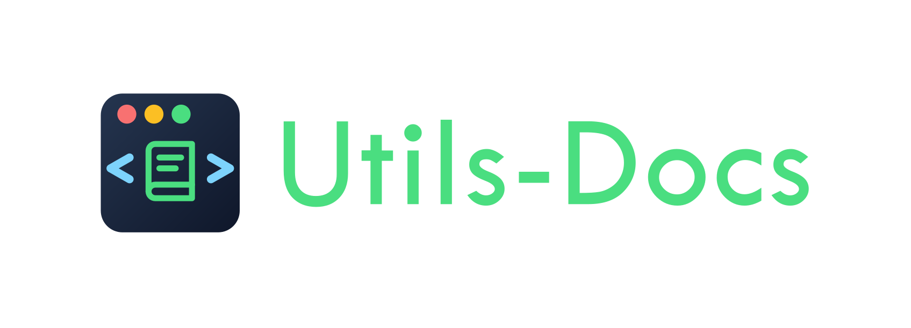

  

---

**Посетить можно тут**: [https://purpleswtr.github.io/Utils-Docs/](https://purpleswtr.github.io/Utils-Docs/)

---

# Utils Docs

## Это моя личная **база знаний**. 

Я расширяю её при помощи самописных скриптов, а также собираю тут полезные команды, код, сниппеты и решения разных задачек и кейсов с которыми сталкиваюсь.

Буду называть это своим конспектом для усвоения материала!

Также пишу полноценное приложение с бэкендом и фронтендом для того чтобы удобнее и быстрее взаимодействовать с базой знаний и пополнять её.

И также неплохой опыт в целом по тому, как вести документацию.

## Посмотреть превью и прочитать про плагины:
  - [Первый плагин на Python для отслеживания mkdocs.yml файла](https://purpleswtr.github.io/Utils-Docs/root/yml_plugin/)
  - [Полноценное приложение для ведения базы знаний](https://purpleswtr.github.io/Utils-Docs/root/app_plugin/)

## Какие бонусы в этом я для себя вижу:

<li>Навык ведения документации</li>
<li>Личная база знаний к которой можно обращаться с помощью полнотекстового поиска</li>
<li>Удобный инструмент настроенный под себя</li>
<li>На перспективу - возможность поделиться с другими разработчиками в понятном виде как информацией, так и решениями для удобного self-hosted ведения базы знаний</li>
</ul>

> Однажды я буду благодарен себе за то, что начал вести эту документацию!
